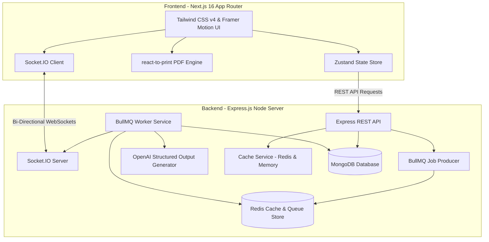

# VedaAI – AI Assessment Creator

VedaAI is a production-ready, full-stack monorepo application designed to help teachers create structured, curriculum-compliant academic assessment question papers and assignments using state-of-the-art AI generation.

---

## 🏗️ Architecture Overview

VedaAI is structured as a monorepo consisting of a fast Next.js 16 client and a modular Express.js backend. The system is engineered to work reliably on standard server configurations while degrading gracefully to a **Zero-Dependency Mode** in serverless or local offline environments.



### Core Architecture Components

1. **Client Layer (Next.js 16 App Router & Tailwind CSS v4)**:
   - Built on React 19 and Next.js 16 App Router.
   - Global state is handled via a **Zustand store** (`useAssessmentStore`) that manages loading, active papers, list states, and backend dispatchers.
   - Implements a dual-mode communication hook (`useSocket`): it connects to the Socket.IO server for real-time progress events, falling back to HTTP short-polling if the environment is stateless (e.g., Serverless Functions).

2. **API & Orchestration Layer (Express.js)**:
   - Receives form data and reference document uploads via **Multer** buffer memory storage.
   - Manages asynchronous background processing using **BullMQ** and **Redis** to avoid client-side API timeout blocks during complex AI generations.

3. **Hybrid Caching Layer (Redis + In-Memory Fallback)**:
   - Implements a dual-mode cache (`cacheService.ts`) in the backend. 
   - If Redis is connected, it stores cached data on Redis with specific TTLs.
   - If Redis is offline, it transparently falls back to an in-memory `Map` cache with a maximum capacity limit (evicting the oldest entries) and time-based expiration.
   - Integrated at the data layer (`dbService.ts`) to speed up subsequent loads for assignments, generated exam papers, and list queries.

4. **Stateless Database & Worker Fallbacks (Zero-Dependency Mode)**:
   - **MongoDB Fallback**: The DB service checks Mongoose connection status. If MongoDB is offline, it transparently redirects all writes and reads to a local in-memory JavaScript repository pre-populated with high-quality Chemistry, Mathematics, and History assessments.
   - **Redis/BullMQ Fallback**: If Redis connection is offline, the API bypasses the queue and runs the generation in-process using an async execution block (`inProcessWorker.ts`).
   - **AI Generation Fallback**: If the OpenAI API key is missing, a localized mock generation service parses the inputs and outputs curriculum-grade structured question sets mapping to the selected subjects and difficulty distributions.

---

## 🛠️ Step-by-Step Approach

The development of VedaAI followed a systematic pipeline to ensure decoupling and reliability:

1. **Modular In-Memory Datastores First**:
   - We built the database-agnostic service wrapper (`dbService.ts`) early on. This allowed us to run, compile, and test the entire project locally without needing database servers active, accelerating UI integration.
2. **Hybrid Caching Layer**:
   - Designed a hybrid cache service that sits in the backend's data layer. It reduces DB load for frequently fetched assets (like the generated question papers during print views or teacher editing) and manages automatic cache invalidation during data mutations (creates, updates, deletes).
3. **Strict JSON Schema Enforcement**:
   - The AI generation routine utilizes OpenAI's structured schema format to enforce type safety on responses. The output always matches the structured typescript interfaces (`ISection`, `IQuestion`, `IGeneratedPaper`).
4. **Double-Layered Connection Resilience**:
   - The client-side `useSocket` hook wraps connection sockets safely. If connection is lost or Socket.IO is blocked (like in serverless hosting), the hook mounts an HTTP interval routine that polls `/api/result/:id` every 1.5 seconds, mapping updates to the progress UI identically.
5. **Build-Time Variable Alignment for Deployments**:
   - Because client-side `NEXT_PUBLIC_` variables are baked in during page compilation, we deployed the frontend using both Vercel runtime parameters and build-time env hooks (`--build-env`), preventing localhost fallbacks in production bundles.

---

## 🚀 Setup & Running Guide

### Prerequisites
- Install **Node.js** (v18 or higher)
- Ensure **MongoDB** is running locally (`mongodb://127.0.0.1:27017/vedaai`) *[Optional]*
- Ensure **Redis** is running locally on port `6379` *[Optional]*
*(If MongoDB/Redis are offline, the system will enter **Zero-Dependency Mode** automatically).*

### Environment Configuration

#### 1. Backend Config (`/backend/.env`)
Create a `.env` file in the `backend/` directory:
```env
PORT=5000
MONGODB_URI=mongodb://127.0.0.1:27017/vedaai
REDIS_URL=redis://127.0.0.1:6379
OPENAI_API_KEY=your_openai_api_key_here
```

#### 2. Frontend Config (`/frontend/.env.local`)
Create a `.env.local` file in the `frontend/` directory:
```env
NEXT_PUBLIC_API_URL=http://localhost:5000/api
NEXT_PUBLIC_SOCKET_URL=http://localhost:5000
```

### Installation & Run

From the root workspace directory, run:
```bash
# Installs workspace dependencies and recursive child folders
npm run install:all

# Starts both frontend and backend concurrently in development mode
npm run dev
```
- **Frontend App**: `http://localhost:3000`
- **Backend API**: `http://localhost:5000`

---

## 💎 Bonus Implementations & UI Polish

We have implemented several professional upgrades to set the codebase apart:

### 1. High-Fidelity PDF Export (`react-to-print`)
- Rather than running heavy server-side PDF render engines that introduce layout bugs, VedaAI leverages the client's native browser engine via `react-to-print`.
- Renders a clean academic paper stylesheet (`ExamPaper.tsx`) featuring dotted candidate metadata boxes, points badges, and structured sections.
- Embedded custom `@media print` rules and container-level `print:break-inside-avoid` styles prevent page-breaks from cutting questions or model answers in half, automatically hide navigation buttons (`print:hidden`), and force margins optimized for Letter/A4 sizing.

### 2. Dual-Mode Hybrid Caching Engine
- Implemented a unified cache wrapper in `cacheService.ts` that acts as a bridge between Redis and an in-memory Map structure. 
- Assignments, generated papers, and query lists are fetched from the cache in under 2ms.
- Implements strict cache invalidation on data mutations (creation, updates, deletion, single-question regeneration) to guarantee eventual consistency across all user threads.

### 3. Auto-playing Instagram-Style Story Slideshow
- The **About Developer** page features an auto-playing slideshow that rotates through 6 media clippings and certificates every 5 seconds.
- **Instagram-Style Progress Timelines**: Features 6 horizontal bars at the top of the photo card that fill up linearly over 5 seconds.
- **Interactive Tap Controls**: Splits the click zones (clicking the left 30% goes to the previous slide, clicking the right 70% goes forward) with hover chevrons and custom resizing pointers (`cursor-w-resize`, `cursor-e-resize`).
- **Hover-to-Pause**: Hovering over the image stops the slideshow timer, allowing users to read newspaper text.
- **Double-Layer Aspect-Ratio Optimization**: Integrates a blurred back-layer copy (`object-cover blur-xl opacity-30`) to fill the container, combined with a sharp foreground container (`object-contain`) to ensure portrait/landscape images fit cleanly without text cropping.

### 4. Advanced 3D Particle Parallax Background
- Built a custom particle projection background canvas (`ThreeDBackground.tsx`) featuring:
  - 100+ node coordinates moving with random velocity vectors in 3D space.
  - Automatic boundary bouncing and connecting grid lines.
  - Interactive laser beams (diagonal shooting energy stars) flashing across the screen with glowing tail blurs.

### 5. Parallax 3D Tilt Card
- The profile card on the About page listens to cursor coordinates. It tilts dynamically in 3D space (up to 12 degrees max) with depth-offset transformations (`translateZ`) applied to the profile photo and headers for three-dimensional popping depth.

### 6. Modern Typography overrides
- Applied specialized modern typography overrides across the About page scope:
  - **Space Grotesk** as the primary reading typeface.
  - **Orbitron** for digital-tech header styling.
  - **JetBrains Mono** for code fragments, achievement tables, and monospace metrics.
